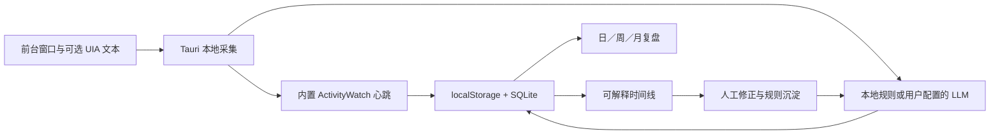

# 墨记

墨记是一款本地运行的桌面工作复盘工具。它通过定时采集窗口元数据和可选的 UI 文本，把零散的窗口、文档、沟通和开发记录整理成可编辑的时间线，并按需生成日报、周报、月报和效率分析。应用支持有 LLM、无 LLM 两种模式；无 LLM 模式使用本地分类规则，不调用外部 API。


## 一分钟体验

1. 从 [GitHub Releases](https://github.com/yinbing-666/moji/releases) 下载 Windows 安装包并启动墨记。
2. 在首次设置中确认隐私边界，选择「有 LLM」或「无 LLM」。
3. 点击「先看一周示例」，载入带上周同比基线的虚构活动。
4. 打开「时间轴」查看规则命中依据，再到「报告 → 效率分析 → 本周」查看完整周复盘。
5. 演示结束后在仪表盘点击「移除示例」，真实记录不会被覆盖或删除。


## 产品闭环



墨记不是 ActivityWatch 的换皮界面，也不是连续录屏工具。它聚焦「采集 → 解释 → 修正 → 复盘」：用户能看到活动为什么被这样分类，也能把一次人工修正沉淀为后续规则。

## 核心工作流

```text
启动墨记
  -> 定时枚举可见窗口（元数据 + 可选截屏）
  -> 经 UI Automation 只读采集窗口内文本（本地，不上云）
  -> 纯文本模型归纳活动，或由本地关键词规则分类
  -> 保存活动记录到本地 localStorage + SQLite
  -> 人工筛选、修正、导出或生成报告
```

## 技术栈

- 前端：React 19 + TypeScript + Tailwind CSS 4 + 自定义 CSS 设计系统
- 设计系统：Tailwind 工具类，紧凑型桌面工具布局
- 桌面：Tauri 2.x + Rust
- 存储：localStorage + SQLite（Rust rusqlite）
- 窗口采集：Windows 原生窗口 API 和 UI Automation
- AI：OpenAI 兼容接口
  - 活动分析 / 报告生成共用纯文本模型（无需多模态视觉模型）
  - 请求经 Rust 后端 `chat_completions` 代理（reqwest），绕过浏览器 CORS 限制；API Key 以明文存于本机独立 localStorage 键（详见隐私说明）
- UI：React 19 + Tailwind CSS 4 + 自定义设计系统
  - 桌面级布局：侧边栏（仪表盘 / 时间轴 / 报告 / 采集健康 / 回溯 / 设置）+ 内容区，采集状态与主控开关常驻侧边栏
  - 仪表盘：深色「今日投入」时长英雄卡、主要应用 / 类型卡、24 小时彩色活动时间轴（对数缩放）、分类占比堆叠条
  - 卡片层次阴影、分类彩色徽章（开发靛蓝 / 会议橙 / 文档青 / 沟通玫红 / 其他灰）
  - 系统字体栈（Segoe UI / 微软雅黑 / PingFang），细滚动条、状态呼吸点
- AI 接口：任何 OpenAI 兼容服务均可（Base URL、模型名在设置中填写，默认留空）

## 已实现功能

- 定时采集：支持 1/2/5/10 分钟间隔，可手动启停。
- 多窗口采集：枚举 Windows 可见窗口，前台窗口优先，并返回 PID、进程名、进程路径、Z 顺序等元数据。
- 窗口文本识别：通过 UI Automation 只读采集窗口内控件文本（标签页、文件路径、编辑框内容等），纯文本模型归纳活动，不截图、不上云图像。
- 采集节流：可设置每轮最多分析 1/2/3/5/8 个窗口，默认 3 个，并会跳过重复窗口。
- AFK 与锁屏剔除：锁屏时立即暂停采集；空闲阈值可设为 1/3/5/10/15 分钟，未达到阈值时按实际活跃秒数记录。
- 可选上下文：浏览器域名和 IDE 项目名默认关闭，可分别开启；只保存域名或项目名，不保存完整 URL、文件内容。
- 隐私排除：可按应用名、窗口标题或进程名关键词跳过采集与分析；密码框等敏感控件自动跳过。
- AI 活动识别：按开发、会议、文档、沟通、其他分类生成中文活动描述。
- 本地分类规则：支持按应用名、窗口标题设置关键词规则，可调整顺序、启停、编辑和恢复默认值；未命中的活动进入「未分类」。
- 未分类收件箱：按应用和窗口标题聚合未分类活动，支持批量修正历史分类，并可将处理结果保存为后续规则。
- 规则可解释性：时间轴展示具体命中的规则、字段和关键词；规则编辑器提示空规则、优先级冲突和关键词覆盖冲突。
- 首次启动向导：依次确认隐私边界、分析模式和启动方式；无 LLM 模式无需额外配置即可开始采集。
- 演示数据模式：一键追加虚构工作周及上周同期基线，不覆盖真实记录，并可独立移除。
- 采集健康中心：集中检查窗口采集、内置 ActivityWatch、SQLite 和最近事件状态。
- 本地持久化：localStorage + SQLite 双写保存活动记录和设置；读取时会归一化旧数据和异常字段。
- 缩略图控制：默认关闭截屏（识别不依赖图像）；开启后才会截屏并在活动记录里保存压缩缩略图。
- 活动记录管理：支持关键词搜索、按分类筛选、仅看今天，时间轴按日期分组展示；编辑描述（Ctrl+Enter 保存）、删除单条、清空全部。
- 活动回溯：基于 SQLite 全文检索应用、标题、描述和可选上下文，支持「今天」「昨天」「本周」「上周」「本月」等自然日期范围。
- 活动时长统计：ActivityWatch 源透传事件时长，窗口文本采集按连续采集周期累计停留时间；仪表盘和报告页展示总时长 / 单活动时长 / 应用时长排行（SQLite 已加列并自动迁移旧库）。
- 活动导出：设置页支持导入 / 导出全部活动的 JSON，并支持 SQLite 本地备份与恢复。
- 数据保留：展示数据库占用、活动数量和缩略图数量；可选择永久或 30/90/180/365 天保留期，手动清理前会二次确认并先备份。
- 脱敏诊断导出：可导出服务状态、采集参数计数和本次会话错误；不包含活动、窗口标题、截图或 API 配置值。
- 报告生成：选择日期后用 AI 生成日报，生成后直接在应用内展示，支持复制和下载 Markdown；生成失败、配置缺失只显示为提示，不会污染报告内容。
- 报告历史：本地保存最近 20 条报告，可随时回看、复制、下载、删除。
- 系统托盘：关闭窗口最小化到托盘保持后台采集，左键单击托盘或菜单「显示墨记」唤起窗口，托盘菜单「退出」真正退出。
- 仪表盘：展示今日记录数、主要应用、主要类型、最近活动和手动采集入口。
- 专注与打断分析：合并连续的开发、文档活动，统计专注时段、深度工作、短碎片、应用切换和主要打断来源。
- 周复盘闭环：同时展示本周投入、专注占比、深度工作、打断、未分类、规则覆盖趋势和上周同比，并给出基于证据的下一步建议。
- 周计划对照：按分类设置每周计划分钟，在报告页对照计划、实际投入和总体完成度。
- 本地只读 API：默认关闭，仅监听 `127.0.0.1`；使用区分大小写的 Bearer Token 访问 `GET /health`、`GET /v1/activities` 和 `GET /v1/summary`。
- 本地 MCP：独立 `moji-mcp` 程序提供只读 `stdio` 模式，支持活动搜索、时间汇总和数据库健康检查；配置方法见 [`docs/MCP.md`](docs/MCP.md)。
- 加密目录同步：用户选择本地目录并设置密码后，以 AES-256-GCM 加密快照同步活动、报告历史和周计划；合并前自动备份，不传播删除。
- 数据源注册表：统一展示窗口、内置 ActivityWatch 和用户主动选择的 JSON 文件数据源，不加载第三方动态库或脚本。
- 桌面集成：开机自启、`CommandOrControl+Shift+M` 全局快捷键和系统通知均默认关闭，可在设置页分别启用。
- 专属 PDF 导出：使用内置 A4 模板导出报告，包含报告元信息、分类分布、应用排行、正文和页码，不依赖浏览器打印。
- 中文界面：主流程和设置项已中文化，应用名为“墨记”。

## 环境要求与依赖

### 必需（必须满足才能运行）

| 依赖 | 说明 |
|---|---|
| **Windows 10 / 11（x64）** | 当前唯一支持的平台，提供完整窗口采集、内置 ActivityWatch 和桌面集成 |
| **Node.js 20+** | 前端构建（`npm install` / `npm run build` / `npm run tauri dev`） |
| **Rust stable 工具链** | 后端 Tauri/Rust 编译（`cargo check` / `npm run tauri build`），含 MSVC 链接器（Visual Studio Build Tools） |

### 可选（不装不影响核心功能）

| 依赖 | 作用 | 不装的影响 |
|---|---|---|
| **OpenAI 兼容 API Key** | 启用 AI 活动识别和 AI 报告 | 可使用无 LLM 模式，本地采集、分类、报告和效率分析仍可用 |
| **Python 3** | 运行旧版 ActivityWatch HTML 分析脚本 | 应用内效率分析不受影响 |
| **系统托盘/最小化** | 已内置，无额外依赖 | — |

### AI 接口说明

- 任何兼容 OpenAI `/chat/completions` 的服务均可（OpenAI / DeepSeek / 各类网关），在设置中填写 Base URL 与模型名，默认留空。
- 使用**纯文本模型**即可，无需多模态视觉模型（窗口内容经 UI Automation 读取为文本后送模型归纳）。
- API Key 只保存在本机设置中，不应写入代码仓库、日志。

## 快速开始

```bash
# 安装依赖
npm install

# 启动前端开发服务
npm run dev

# 启动 Tauri 桌面开发模式
npm run tauri dev

# 前端构建检查
npm run build

# Rust/Tauri 编译检查
cd src-tauri
cargo check

# 构建桌面应用
npm run tauri build
```

发布前运行 `./scripts/check-release.ps1` 校验各清单版本一致；完整检查和安装包 SHA-256 生成方式见 [`docs/RELEASE.md`](docs/RELEASE.md)。

> **内置 ActivityWatch**：应用内置 Windows x64 版 `aw-server-rust`（0.13.2，MPL-2.0），随安装包分发，无需单独安装。该二进制约 27 MB，**不纳入 Git 仓库**（见 `THIRD_PARTY_NOTICES.md`）：已发布到本仓库 GitHub Release（`aw-server-rust-0.13.2`）。开发者可运行 `scripts/fetch-aw-server.ps1`，将文件下载到 `src-tauri/vendor/activitywatch/`；也可从 [Release 页面](https://github.com/yinbing-666/moji/releases/tag/aw-server-rust-0.13.2) 手动下载。文件缺失时，应用会继续使用窗口采集记录活动，但 ActivityWatch 时长数据不可用。

开发服务默认地址为 `http://127.0.0.1:1420/`。

## API Key 配置

1. 打开应用，进入“设置”。
2. 填入兼容 OpenAI `/chat/completions` 的 API Key。
3. 填写 Base URL（任何 OpenAI 兼容服务，如 OpenAI / DeepSeek / 各类网关）。
4. 填写模型名称（该服务下可用的纯文本对话模型）。
5. 点击“保存设置”。
6. 回到仪表盘点击“开始采集”。

API Key 只保存在本机设置中，不应写入代码仓库、日志。

## 隐私说明

- 活动识别基于窗口内 UI 文本（进程名、窗口标题、控件文本），默认不截屏。
- 开启“保存截图缩略图”后才会截屏，并在活动记录里保存压缩后的缩略图。
- 排除应用会根据窗口标题或进程名关键词跳过采集；UIA 采集自动跳过密码框。
- AI 分析只附带进程名、可执行文件名、窗口标题和窗口内文本，不发送完整本机进程路径。
- 活动记录和设置保存在本机 localStorage 与 SQLite。
- 浏览器域名和 IDE 项目名采集默认关闭；开启后只保存结构化域名或项目名，不保存完整 URL、文件内容。
- 本地只读 API 默认关闭；开启后只监听 `127.0.0.1`，所有端点都需要用户生成的访问令牌。
- API Key 以明文形式保存在本机 localStorage 的独立 `xiaohei-settings-api-key` 键中，未做加密。这是本地信任模型下的权衡，同一用户下的其他进程理论上可读取；在共享或不可信设备上使用时请注意。
- 加密同步只读写用户选择的本地目录。墨记不连接云账号；OneDrive、坚果云或 Syncthing 等目录同步由对应工具负责。
- 同步密码单独保存在当前设备，不写入同步文件或普通设置对象。忘记密码后无法读取已有同步快照。

| 数据 | 默认行为 | 用户控制 |
|---|---|---|
| 应用名、窗口标题、活动时长 | 本机采集和保存 | 可按应用或标题排除 |
| UI Automation 文本 | 本机读取 | 有 LLM 模式才会发送允许的文本到用户配置接口 |
| 浏览器域名、IDE 项目名 | 默认关闭，不采集 | 可分别开启；只保存结构化域名或项目名 |
| 截图缩略图 | 默认关闭 | 设置中显式开启后才保存 |
| 完整 URL、文件内容、密码框、屏幕录制、音频 | 不采集 | 不提供隐式开启路径 |
| 本地只读 API | 默认关闭 | 开启后仅允许持有访问令牌的本机客户端访问 |
| 本地 MCP | 客户端未配置时不运行 | 只读 `stdio` 进程，返回内容取决于客户端查询 |
| 加密同步快照 | 默认关闭，不创建 | 用户选择目录并输入密码后才读写 `.moji` 文件 |
| 示例活动 | 使用独立 `demo-` 标记 | 可一键移除，不影响真实记录 |

## 项目结构

```text
├── src/
│   ├── App.tsx                    # 主界面：仪表盘、活动记录、报告、设置
│   ├── index.css                  # Tailwind CSS 入口
│   ├── components/
│   │   ├── ActivityTimeline.tsx    # 活动记录筛选、编辑、删除、导出
│   │   ├── ReportView.tsx          # 报告生成、复制、下载
│   │   ├── Settings.tsx            # AI、采集、隐私设置
│   │   ├── ScreenshotModal.tsx     # 截图预览
│   │   ├── ErrorBoundary.tsx       # 错误边界
│   │   ├── OnboardingDialog.tsx    # 首次设置向导
│   │   ├── CaptureHealth.tsx       # 采集链路健康中心
│   │   ├── ActivitySearch.tsx      # SQLite 全文检索与自然日期回溯
│   │   └── WeeklyPlanComparison.tsx # 周计划与实际投入对照
│   ├── hooks/
│   │   ├── useAutoCapture.ts       # 定时采集、UIA 文本读取、AI 分析、记录写入
│   │   └── useScreenshot.ts        # 采集计时器
│   ├── stores/
│   │   └── activityStore.tsx       # 活动与设置状态
│   └── utils/
│       ├── ai.ts                   # AI 窗口文本分析与报告生成（纯文本模型）
│       ├── export.ts               # Markdown/JSON 下载
│       ├── demoData.ts             # 虚构示例周与上周基线
│       ├── classificationRules.ts  # 分类、命中解释与冲突检测
│       ├── contextSignals.ts       # 浏览器域名与 IDE 项目名提取
│       ├── searchQuery.ts          # 自然日期范围解析
│       └── screenshot.ts           # Tauri 窗口采集封装
├── src-tauri/
│   ├── src/
│   │   ├── lib.rs                  # Tauri 入口
│   │   ├── screenshot.rs           # 窗口枚举 + 可选截屏实现
│   │   ├── uia.rs                  # UI Automation 窗口文本采集（替代视觉识别）
│   │   ├── system.rs               # 前台窗口、空闲、锁屏检测
│   │   ├── aw.rs                   # ActivityWatch 数据源
│   │   ├── db.rs                   # SQLite 持久化、全文检索与数据保留
│   │   ├── local_api.rs            # 默认关闭的本地只读 API
│   │   ├── mcp.rs                  # 只读 stdio MCP
│   │   ├── query.rs                # HTTP API 与 MCP 共用查询层
│   │   ├── sync.rs                 # 加密目录同步
│   │   ├── data_source.rs          # 内置数据源注册表
│   │   ├── desktop.rs              # 自启、快捷键、通知和目录选择
│   │   └── pdf.rs                  # A4 PDF 报告导出
│   ├── capabilities/               # Tauri 权限配置
│   └── tauri.conf.json             # Tauri 应用配置
└── README.md
```

## 当前限制

- 当前版本只支持 Windows 10／11 x64，不提供 macOS 或 Linux 安装包。
- 窗口文本采集依赖应用支持 UI Automation。个别自绘控件可能读不到文本，此时降级为按进程名和标题判断。
- 加密同步不提供云账号、远端删除传播或多人协作；云端传输由用户选择的目录同步工具负责。
- 分类规则使用固定的一级分类（开发、会议、文档、沟通、其他）；尚未提供自定义分类层级。
- 浏览器上下文只支持从窗口标题提取域名，IDE 上下文只支持提取项目名；不保存完整 URL、编辑器文件路径或文件内容。
